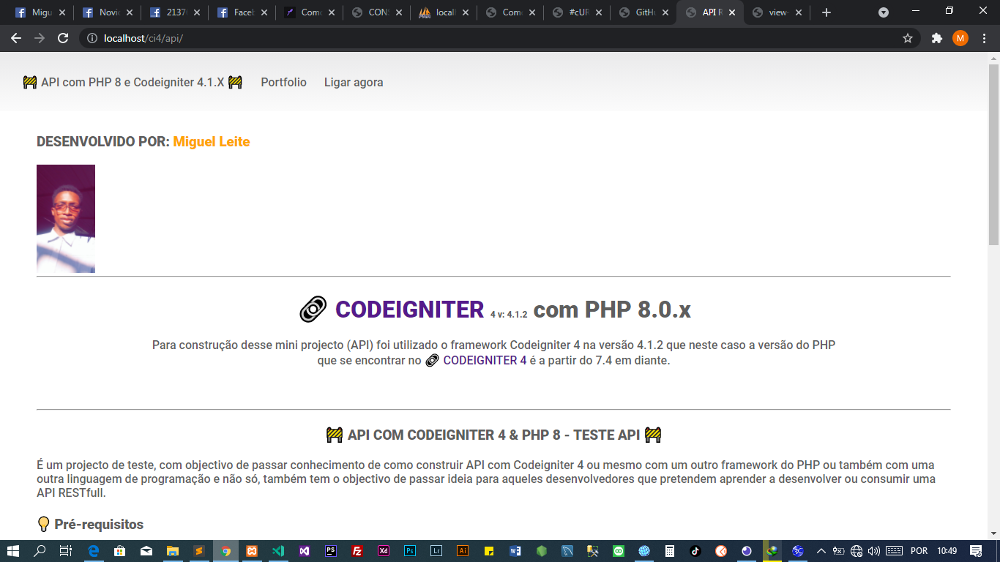

<h1> API COM CODEIGNITER 4 e PHP 8 </h1>

## COMO CONSTRUIR UM MINI API COM CODEIGNITER 4 COM PHP 7.4 / 8.0.X

<h1 align="center">
    <a href="https://codeigniter.com/">🔗 CODEIGNITER 4 v: 4.1.2</a> com PHP 8.0.x
</h1>

 Para construção desse mini projecto (API) foi utilizado o framework Codeigniter 4 na versão 4.1.2 que neste caso a versão do PHP que se encontrar no <a href="https://codeigniter.com/">🔗 CODEIGNITER 4 </a>  é a partir do 7.4 em diante.

<!--ts-->
   * [Sobre](#sobre)
   * [Instalação](#instalacao)
   * [Como usar](#como-usar)
<!--te-->

<h3 align="center" id="sobre"> 
	🚧  API COM CODEIGNITER 4 & PHP 8 - Projecto de teste API  🚧
</h3>

    É um projecto de teste, com objectivo de passar conhecimento de como construir API com Codeigniter 4 ou mesmo com um outro framework do PHP ou também com uma outra linguagem de programação e não só, também tem o objectivo de passar ideia para aqueles desenvolvedores que pretendem aprender a desenvolver ou consumir uma API RESTfull.

### Features

- [x] Busca uma lista de usuário
- [x] Busca usuário por id
- [x] Cadastro de usuário
- [x] Actualiza dados de usuário
- [x] Apaga dados de usuário
- [x] Busca uma lista de tokens
- [x] Busca token por id
- [x] Cadastro de tokens
- [x] Atualização de tokens
- [x] Deleção de tokens
- [x] Verifica se um token é valido no sistema
- [x] Login pronto
- [x] Filtros nas rotas
- [x] Validação do nº do BI
- [x] Validação do nº de telefone (Angola)

<h1 align="center">
  
</h1>

<h3 id="instalacao"> 💡 Pré-requisitos </h3>

Antes de começar, você vai precisar ter instalado em sua máquina as seguintes ferramentas:
WampServer/XAMPP v:3.3.0 ou uma versão superior, vai precisar também do Insominia ou Postaman para poder teste a API. 
Além disto é bom ter um editor para trabalhar com o código como [VSCode](https://code.visualstudio.com/).

Depois de teres tudo isso instalado na sua maquina, acessa a pasta de projecto do seu servidor, se for o XAMPP estamos a falar da pasta htdocs e se for o WAMMPSERVER estamos a falar da pasta www. 

Depois de teres acessado a pasta do seu servidor local criar uma pasta com o nome ci4 e dentro desta pasta coloca a pasta do projecto e renomea ele com o nome api.

<strong> É obrigatório renomear a pasta do projecto? </strong> Sim é, devido a configuração feita, depois de se familiarizar com o projecto podes colocar ele numa outra pasta e pode renomear o projecto com um nome a sua escolha. 

<h3 id="como-usar">🎲 Como consumir a API</h3>

Primeiramente pega a base de dados com nome ci4.sql que se encontra na pasta do projecto, acessa o PhpMyAdmin e em seguida importa a base de dados no servidor ou mesmo executa o código SQL no seu servidor.

Para começar fazer o teste desta API deves ter em conta que essa API recebe apenas dados do tipo JSON e pelo qual ele 
retorna os dados no mesmo formato que neste caso estamos a falar do formato JSON.

Para consumir essa API tens que passar um token válido no sistema caso não tenhas um token válido ou se não passares um token não sera possível enviar e receber dados da API.

O token deve ser enviado no formato JSON que é obrigatório armazenar ou seja guarda esse token o indice com nome "vToken", caso o token não se encontra armazenado no indice "vToken" não sera possível consumir a API.

Caso tenhas armazenado esse token no indice vToken, abaixo temos as rotas definidas da nossa API.  

### Rotas definidas

<!--ts-->
* [USUÁRIO]
    * [Listar todos usuário (GET) -> http://localhost/ci4/api/api/get/users]
    * [Listar usuário por ID (GET) -> http://localhost/ci4/api/api/get/one/user/4]
    * [Cadastrar novo usuário (POST) -> http://localhost/ci4/api/api/new/user]
    * [Actualizar dados do usuário (UPDATE) -> http://localhost/ci4/api/api/update/user/5]
    * [Apagar dados registro do usuário (DELETE) -> http://localhost/ci4/api/api/delete/user/6]
    * [Efectuar login (POST) -> http://localhost/ci4/api/api/login/user]
* [TOKEN]
    * [Listar todos tokens (GET) -> http://localhost/ci4/api/api/get/tokens]
    * [Listar por ID (GET) -> http://localhost/ci4/api/api/get/one/token/1]
    * [Cadastrar novo token (POST) -> http://localhost/ci4/api/api/new/token]
    * [Actualizar dados do token (UPDATE) -> http://localhost/ci4/api/api/update/token/3]
    * [Apagar dados registro do token (DELETE) -> http://localhost/ci4/api/api/delete/token/9]
<!--te-->

### 🔗 Endpoints

Embaixo segue a lista e descrição de endpoints implementados nesse projecto. OBS: o projecto está rodar localmente.

<h4> Lista de usuários </h4>

 Retorna uma lista de usuário com seus respectivo token. 

<strong>GET: </strong> <code> http://localhost/ci4/api/api/get/users </code> 

 <strong> Exemplo de consultar </strong> 

<code>

    http://localhost/ci4/api/api/get/users

    {
	    "vToken": "c4a1fc70e4c269ac6408321a5c2ab885"
    }

</code>

 <strong> Buscar usuário por ID </strong> 

 Retorna dados do usuário selecionado com seu respectivo token. 

<strong>GET: </strong> <code> http://localhost/ci4/api/api/get/one/user/4 </code> 

<code>

    http://localhost/ci4/api/api/get/one/user/4
    
    {
        "vToken": "c4a1fc70e4c269ac6408321a5c2ab885"
    }
</code>

 <strong> Cadastrar novo usuário </strong> 

 Retorna dados do usuário cadastrado com seu respectivo token. 

 <strong> POST: </strong> <code> http://localhost/ci4/api/api/new/user </code> 

<code>

    http://localhost/ci4/api/api/new/user
    
    {
        "name": "Miguel",
        "lastName": "Leite",
        "bi": "224456674LD167",
        "phone": "+244945633425",
        "email": "miguelleite200leite6@gmail.com",
        "password": "1234567",
        "token": "b3b9fc70e4c279ac6408321a8c9ac671",
        "vToken": "c4a1fc70e4c269ac6408321a5c2ab885"
    }

</code>

 <strong> Atualizar dados do usuário </strong> 

 Retorna dados do usuário actualizado com seu respectivo token. 

 <strong> PUT: </strong> <code> http://localhost/ci4/api/api/update/user/5 </code> 

<code>

    http://localhost/ci4/api/api/update/user/5
    
    {
        "name": "testando",
		"lastName": "minha api",
		"bi": "034456674LD487",
		"phone": "+244945633425",
		"email": "miguelleite200leite@gmail.com",
		"password": "12345678",
		"token": "b3b9fc80e4c279ab0578321a8c2ac671",
		"vToken": "c4a1fc70e4c269ac6408321a5c2ab885"
    }

</code>

 <strong> Eliminar dados do usuário </strong> 

 Retorna dados do usuário eliminado com seu respectivo token. 

 <strong> PUT: </strong> <code> http://localhost/ci4/api/api/delete/user/5 </code> 

<code>

    http://localhost/ci4/api/api/delete/user/5
    
    {
		"vToken": "c4a1fc70e4c269ac6408321a5c2ab885"
    }

</code>

 <strong> LOGIN - Usuário </strong> 

 Retorna todos dados do usuário caso o login for efectuado. 

 <strong> POST: </strong> <code> http://localhost/ci4/api/api/login/user </code> 

<code>

    http://localhost/ci4/api/api/login/user
    
    {
        "email": "miguelleite200leite1@gmail.com",
        "password": "1234567",
        "vToken": "c4a1fc70e4c269ac6408321a5c2ab885"
    }

</code>

<h4> Listar os token </h4>

 Retorna uma lista de token com seus respectivo status. 

<strong>GET: </strong> <code> http://localhost/ci4/api/api/get/tokens </code> 

 <strong> Exemplo de consultar </strong> 

<code>

    http://localhost/ci4/api/api/get/tokens

    {
	    "vToken": "c4a1fc70e4c269ac6408321a5c2ab885"
    }

</code>

 <strong> Buscar token por ID </strong> 

 Retorna o token selecionado com seu respectivo status. 

<strong>GET: </strong> <code> http://localhost/ci4/api/api/get/one/token/4 </code> 

<code>

    http://localhost/ci4/api/api/get/one/token/4
    
    {
        "vToken": "c4a1fc70e4c269ac6408321a5c2ab885"
    }
</code>

 <strong> Cadastrar novo token </strong> 

 Retorna o token cadastrado com seu respectivo statu. 

 <strong> POST: </strong> <code> http://localhost/ci4/api/api/new/token </code> 

<code>

    http://localhost/ci4/api/api/new/token
    
    {
        "token": "b3b9fc70e4c279ac6401241a8cac671",
        "vToken": "c4a1fc70e4c269ac6408321a5c2ab885"
    }

</code>

 <strong> Atualizar o token </strong> 

 Retornao o token actualizado com seu respectivo status. 

 <strong> PUT: </strong> <code> http://localhost/ci4/api/api/update/token/5 </code> 

<code>

    http://localhost/ci4/api/api/update/token/5
    
    {
		"token": "b3b9fc80e4c279ab0578321a8c2ac671",
		"vToken": "c4a1fc70e4c269ac6408321a5c2ab885"
    }

</code>

 <strong> Eliminar token </strong> 

 Retorna o token eliminado com seu respectivo statu. 

 <strong> DELETE: </strong> <code> http://localhost/ci4/api/api/delete/token/5 </code> 

<code>

    http://localhost/ci4/api/api/delete/token/5
    
    {
		"vToken": "c4a1fc70e4c269ac6408321a5c2ab885"
    }

</code>

## 🛠️ Tecnologias

 Este projecto foi construído usando as seguintes tecnologias: 

 
    <a href="javascript:;">PHP 8.0.X</a> | <a href="https://codeigniter.com"> CODEIGNITER 4.1.X</a>

## AUTOR

<h3 id="Miguelleite"> Miguel Leite <h3>
<h1 align="left">
  
</h1>

## Licença

Copyright (c) 2021 <strong> Miguel Leite <strong>

Permission is hereby granted, free of charge, to any person obtaining a copy
of this software and associated documentation files (the "Software"), to deal
in the Software without restriction, including without limitation the rights
to use, copy, modify, merge, publish, distribute, sublicense, and/or sell
copies of the Software, and to permit persons to whom the Software is
furnished to do so, subject to the following conditions:

The above copyright notice and this permission notice shall be included in all
copies or substantial portions of the Software.

THE SOFTWARE IS PROVIDED "AS IS", WITHOUT WARRANTY OF ANY KIND, EXPRESS OR
IMPLIED, INCLUDING BUT NOT LIMITED TO THE WARRANTIES OF MERCHANTABILITY,
FITNESS FOR A PARTICULAR PURPOSE AND NONINFRINGEMENT. IN NO EVENT SHALL THE
AUTHORS OR COPYRIGHT HOLDERS BE LIABLE FOR ANY CLAIM, DAMAGES OR OTHER
LIABILITY, WHETHER IN AN ACTION OF CONTRACT, TORT OR OTHERWISE, ARISING FROM,
OUT OF OR IN CONNECTION WITH THE SOFTWARE OR THE USE OR OTHER DEALINGS IN THE
SOFTWARE.
